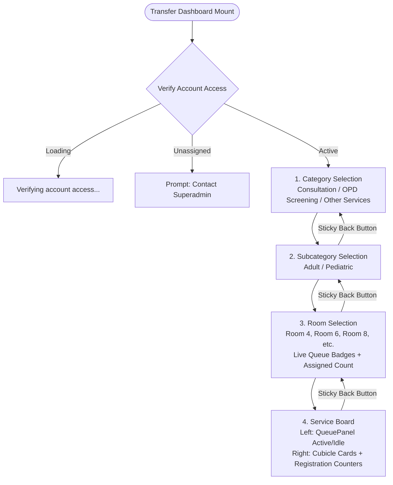

# Heart Check PHC — Patient Transfer Dashboard Architecture & Clinical Guide

## 1. Overview & Clinical Context

The **Patient Transfer Dashboard** (`app/transfer/`) is the central operational interface utilized by clinical receptionists, triage nurses, and queue managers at the Philippine Heart Center's (PHC) Outpatient Department.

In PHC's OPD operations, patients arriving after kiosk check-in undergo a structured clinical progression:
1. **Registration & Verification:** Patients are called to numbered registration windows (`Counter 1`, `Counter 2`, etc.) to verify appointments and documents.
2. **Clinical Room & Triage Sorting:** Patients are categorized by service domain (Consultation, OPD Screening, Specialized Diagnostics) and subcategory (Adult vs. Pediatric).
3. **Doctor & Station Assignment:** Patients waiting in the queue must be transferred and assigned to available consultation cubicles (e.g. `Room 4 - Cubicle 1`) staffed by active physicians.

The Transfer Dashboard provides real-time, low-friction control over this entire pipeline while strictly adhering to hospital queueing policies and touch-enabled clinical hardware.

---

## 2. Core Architectural Principles

The Transfer Dashboard was recently overhauled to achieve full compliance with `AGENTS.md` standards and hospital workflow rules:

### A. Strict FIFO Queue Discipline
- In clinical outpatient settings, allowing staff to reorder or pick arbitrary patients from the queue causes patient dissatisfaction and unfair queue jumping.
- **Enforcement:** The active queue displays patients in strict arrival sequence. Only the top patient (`index === 0`, designated as **"Serving Next"**) is unlocked, draggable, and assignable to a cubicle. All subsequent patients in the stack (`index > 0`) are locked with a lock badge, ensuring that patients are processed in genuine First-In, First-Out order.

### B. Pointer Events Drag-and-Drop Engine
- The previous HTML5 drag-and-drop / raw mouse event implementation was incompatible with clinical tablet screens, touchscreen monitors, and stylus pens.
- The new drag engine is built entirely on unified **Pointer Events** (`pointerdown`, `pointermove`, `pointerup`, `pointercancel`):
  - Normalizes pointer coordinates across touch devices and mouse pointers.
  - Implements a dedicated touch grip handle (`data-drag-handle="true"`) to prevent accidental drags during touch scrolling.
  - Renders a floating preview card through a React Portal (`DragGhost.tsx`) directly attached to `document.body` for smooth, zero-latency movement.
  - Employs `document.elementsFromPoint()` to dynamically detect drop targets (`[data-cubicle-id]`, `[data-counter-id]`) under the cursor or finger.

### C. Sticky Navigation & Viewport-Pinned Architecture
- Clinical staff frequently scroll through long lists of cubicles and registration counters. Previously, scrolling the page scrolled away the breadcrumbs and back button, forcing users to scroll all the way back up to navigate.
- **Enforcement:**
  - The outer viewport is pinned at `h-screen overflow-hidden`.
  - The main header and the sub-header containing `BreadcrumbNav` and `BackButton` are marked `shrink-0 z-20`, remaining permanently visible at the top.
  - Only the `<main>` content container scrolls using the custom `.phc-scroll` cross-browser scrollbar (`flex-1 overflow-y-auto min-h-0`).

### D. Safe, Non-Destructive Step-Back Navigation
- Previously, invoking the browser history back action from the dashboard would pop the user out of the dashboard back to `/login` (inadvertently logging them out).
- **Enforcement:** The `BackButton` inside the dashboard intercepts clicks with top priority. Instead of triggering `router.back()`, `handleBack()` inspects dashboard state and steps backward through the hierarchy:
  - If inside a **Room** (`selectedRoom !== null`), it steps back to the **Subcategory** selector (`selectedRoom = null`).
  - If inside a **Subcategory** (`selectedSubcategory !== null`), it steps back to the **Category** selector (`selectedSubcategory = null`).
  - If at the top **Category** level, it remains safely in the dashboard or navigates to `/dashboard` without destroying the active session.

### E. Strict Separation of Concerns (`AGENTS.md`)
- **Copy:** All labels, descriptions, tooltips, empty states, and modal texts are isolated in `app/transfer/constants/transferTexts.ts`.
- **Styling:** Design tokens, color mappings, and inline layout styles are isolated in `app/transfer/constants/transfer.ts`.
- **Modularity:** Monolithic rendering is decomposed into focused, single-responsibility subcomponents (`QueuePanel`, `ServiceBoard`, `CubicleCard`, `RegistrationCounterSection`, `IdleNumbersPanel`, `StepPickers`).

---

## 3. Navigation Hierarchy & State Machine



### Dynamic Room Queue Indicators
When viewing the Room Selection screen, each room card calculates:
1. **Total Queued Patients:** Patients whose `preferredCubicleNums` or assigned cubicles match the room identifier (e.g. `Consultation R4 C1` matches Room 4). Displayed as a glowing red badge `X in queue`.
2. **Total Assigned Patients:** Patients currently placed in the room's cubicles. Displayed as `Y assigned`.

---

## 4. Component Structure & Directory Layout

```text
app/transfer/
├── page.tsx                           # Top-level orchestrator & state manager
├── components/
│   ├── BreadcrumbNav.tsx              # Sticky crumb bar with integrated BackButton
│   ├── ConsultationFlow.tsx           # Consultation multi-step wrapper (Adult/Pedia -> Rooms -> Board)
│   ├── CubicleCard.tsx                # Cubicle station card (doctor, status, assigned pills, call)
│   ├── DoctorsModal.tsx               # Modal to configure doctor assignments per cubicle
│   ├── DoctorsPanel.tsx               # Doctor roster sidebar / lookup panel
│   ├── DragGhost.tsx                  # Portal preview card following the pointer during drag
│   ├── DragHandle.tsx                 # Accessible touch grip handle
│   ├── ElapsedTimer.tsx               # Real-time ticking counter for ongoing consultations
│   ├── IdleNumbersPanel.tsx           # Idle/timed-out patient list with reactivation & remove actions
│   ├── OnProgressSection.tsx          # FIFO queue list (index 0 draggable, index > 0 locked)
│   ├── OPScreeningFlow.tsx            # OPD Screening multi-step wrapper
│   ├── OtherServicesFlow.tsx          # Single-room auxiliary services wrapper
│   ├── QueuePanel.tsx                 # Tabbed queue container (Active Waiting vs. Idle)
│   ├── RegistrationCounterSection.tsx # Vertical list of registration counters (Counter 1, Counter 2)
│   ├── ServiceBoard.tsx               # 2-column layout (QueuePanel on left, Stations on right)
│   ├── Sidebar.tsx                    # Fixed responsive navigation rail
│   └── StepPickers.tsx                # Modular SelectionCard, SubcategoryPicker, and RoomPicker
├── constants/
│   ├── transfer.ts                    # CSSProperties, layout tokens, theme palettes
│   └── transferTexts.ts               # Complete text dictionary
├── hooks/
│   ├── dragUtils.ts                   # Pointer coordinate extraction & drop target resolver
│   ├── useAutoAssign.ts               # Automated queue-to-cubicle assignment algorithm
│   ├── useAutoRotate.ts               # Queue rotation trigger
│   ├── useCubicleData.ts              # Cubicle and doctor query hook
│   ├── useDragAndDrop.ts              # Pointer drag state for queue -> cubicle transfers
│   ├── useIdlePatients.ts             # Idle patient timeout listener
│   ├── useIdleTimeout.ts              # Inactivity detection
│   ├── useMaxRotations.ts             # Rotation ceiling policy
│   ├── useMyAccess.ts                 # Role & room access verification hook
│   ├── usePatientData.ts              # Live patient fetch and Supabase Realtime sync
│   ├── useRealtimeSubscription.ts     # Supabase Realtime channel manager
│   ├── useRegistrationDragAndDrop.ts  # Pointer drag state between registration counters
│   ├── useRegistrationRotate.ts       # Registration counter patient cycler
│   ├── useRequireAuth.ts              # Authentication guard
│   └── useRotateTimeout.ts            # Rotation interval timer
└── lib/
    ├── constants.ts                   # Legacy constants reference
    └── rotateApi.ts                   # API helper for queue rotate endpoint
```

---

## 5. Pointer Drag and Drop Details

### Coordinate Tracking & Element Detection
When a user begins dragging from the touch handle of the top patient card:
1. `handlePointerDownFromQueue` captures the pointer ID via `e.currentTarget.setPointerCapture(e.pointerId)`.
2. A `pointermove` listener on `window` updates `dragPoint = { x: e.clientX, y: e.clientY }`.
3. `dragUtils.findDropTarget(point)` runs:
   ```typescript
   const elements = document.elementsFromPoint(point.x, point.y);
   const cubicleEl = elements.find(el => el.hasAttribute('data-cubicle-id'));
   return cubicleEl?.getAttribute('data-cubicle-id') ?? null;
   ```
4. As the pointer hovers over valid stations, `.phc-dropzone` triggers border and background highlight effects.
5. On `pointerup`, if dropped over a valid cubicle:
   - If dropping into the **same cubicle** where the patient already sits, the action is safely ignored as a no-op (preventing duplicate key React warnings).
   - If dropping into a **different cubicle**, the patient is appended to that cubicle's assigned list, removed from the queue, and queued in `pendingUpdates` for backend confirmation.

---

## 6. Access Control & Superadmin Bypass

1. Clinical staff accounts are bound to specific assigned rooms and services via the `users` and `user_services` tables.
2. In `useMyAccess.ts`, the hook checks the user's role:
   - If the user has role `'superadmin'` or `'admin'`, the hook automatically bypasses restricted room filtering and grants complete access to all services, rooms, and counters.
   - For standard `'nurse'` and `'staff'` accounts, the hook fetches specific allowed cubicles and rooms.
3. Callbacks (`fetchMyAccess`, `fetchCubicles`) are wrapped in `useCallback` to eliminate infinite re-renders on dashboard mount.
